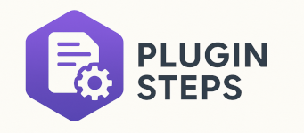

# Plugin Documentation Generator

<p align="center">
  
</p>

<p align="center">
  A Power Platform Tool Box (PPTB) plugin for viewing and documenting Dynamics 365 plugin assemblies and steps. This tool provides an intuitive interface to explore plugin configurations and export documentation in multiple formats.
</p>

## Screenshots

### Dark Theme


### Light Theme


## Features

### Core Capabilities

- 🔌 **Plugin Assembly Browser** - View all plugin assemblies in your Dynamics 365 environment
- 📋 **Plugin Step Details** - Display detailed information about SDK message processing steps
- 🔍 **Advanced Filtering** - Filter assemblies by name and search steps by any property
- 📊 **Sortable Data Grid** - Sort plugin steps by any column with resizable columns
- 📤 **Multiple Export Formats**:
  - CSV file export
  - Copy to clipboard as CSV
  - Copy to clipboard as Markdown table
- 📢 **Visual Notifications** - Toast notifications for all operations
- 📝 **Event Logging** - Track all operations and API calls in real-time
- 🎨 **Theme Support** - Automatic light/dark theme switching based on PPTB settings

### Technical Stack

- ✅ React 18 with TypeScript
- ✅ Fluent UI React Components for consistent Microsoft design
- ✅ Vite for fast development and optimized builds
- ✅ Power Platform Toolbox API integration
- ✅ Dataverse API for querying plugin data
- ✅ Custom hooks for state management
- ✅ Centralized logging service
- ✅ Hot Module Replacement (HMR) for development

## Structure

```
pptb-plugin-documentation-generator/
├── src/
│   ├── components/
│   │   ├── AssemblySteps.tsx      # Data grid for plugin steps
│   │   ├── EventLog.tsx           # Real-time event log display
│   │   ├── Filter.tsx             # Assembly and text filtering
│   │   ├── Overview.tsx           # Main container component
│   │   └── ToolBar.tsx            # Action buttons toolbar
│   ├── hooks/
│   │   ├── useConnection.ts       # Dataverse connection management
│   │   ├── useEventLog.ts         # Event logging hook
│   │   └── useToolboxEvents.ts    # PPTB event subscription
│   ├── mappers/
│   │   ├── pluginAssemblyMapper.ts      # Map API responses to models
│   │   └── pluginAssemblyStepMapper.ts  # Map step data to models
│   ├── services/
│   │   ├── dataverseService.ts    # Dataverse API queries
│   │   └── loggerService.ts       # Centralized logging singleton
│   ├── types/
│   │   ├── pluginAssembly.ts      # Plugin assembly type definitions
│   │   └── pluginAssemblyStep.ts  # Plugin step type definitions
│   ├── utils/
│   │   └── exportUtils.ts         # Export and clipboard utilities
│   ├── App.tsx                    # Main application component
│   ├── main.tsx                   # Entry point
│   └── index.css                  # Global styling
├── dist/                          # Build output
├── index.html
├── package.json
├── tsconfig.json
└── vite.config.ts
```

## Installation

### Prerequisites

- Node.js >= 18.0.0
- npm or yarn
- Power Platform Toolbox installed

### Setup

1. Clone the repository:

```bash
git clone <repository-url>
cd pptb-plugin-documentation-generator
```

2. Install dependencies:

```bash
npm install
```

## Development

### Development Server

Start development server with HMR:

```bash
npm run dev
```

The tool will be available at `http://localhost:5173`

### Watch Mode

Build the tool in watch mode for continuous updates:

```bash
npm run watch
```

### Production Build

Build the optimized production version:

```bash
npm run build
```

The output will be in the `dist/` directory.

### Preview Build

Preview the production build locally:

```bash
npm run preview
```

## Usage

### In Power Platform Toolbox

1. Build the tool:

   ```bash
   npm run build
   ```

2. Package the tool (creates npm-shrinkwrap.json):

   ```bash
   npm run finalize-package
   ```

3. Install in Power Platform Toolbox using the PPTB interface

4. Connect to a Dataverse environment

5. Launch the plugin to view assemblies and steps

### User Interface

#### Filter Section

- **Plugin Assembly Dropdown**: Select an assembly to view its steps
- **Filter Steps SearchBox**: Real-time search across all step properties (name, SDK message, mode, stage, rank, event handler, filtering attributes)

#### Action Buttons

- **Export CSV**: Download plugin steps as a CSV file
- **Copy CSV**: Copy steps to clipboard in CSV format
- **Copy Markdown**: Copy steps to clipboard as a formatted Markdown table

#### Data Grid

- Click column headers to sort
- Drag column borders to resize
- View tooltips on hover for full text content

#### Event Log

- Monitor all operations and API calls
- Color-coded log levels (info, success, warning, error)
- Auto-scrolls to show latest entries

## API Usage

The tool demonstrates various Power Platform Toolbox and Dataverse API features:

### Connection Management

```typescript
// Get current connection
const connection = await window.toolboxAPI.getConnection();
console.log(connection.connectionUrl);

// Listen for connection changes
window.toolboxAPI.onToolboxEvent((event, payload) => {
  if (event === "connection:updated") {
    // Refresh data with new connection
  }
});
```

### Dataverse Queries

```typescript
// Query plugin assemblies
const assemblies = await window.dataverseAPI.executeQuery(
  `pluginassemblies?$select=name,version,pluginassemblyid&$filter=...`
);

// Query SDK message processing steps
const steps = await window.dataverseAPI.executeQuery(
  `sdkmessageprocessingsteps?$select=...&$filter=...&$expand=...`
);
```

### Notifications

```typescript
await window.toolboxAPI.utils.showNotification({
  title: "Export Successful",
  body: "Exported 15 plugin assembly steps",
  type: "success",
  duration: 3000,
});
```

### File Operations

```typescript
// Save file
await window.toolboxAPI.utils.saveFile("plugin_steps.csv", csvContent);

// Copy to clipboard
await window.toolboxAPI.utils.copyToClipboard(content);
```

### Theme Management

```typescript
// Get current theme
const theme = await window.toolboxAPI.utils.getCurrentTheme();
// Returns 'light' or 'dark'

// Listen for theme changes
window.toolboxAPI.onToolboxEvent((event) => {
  if (event === "settings:updated") {
    updateThemeBasedOnSettings();
  }
});
```

### Event Subscription

```typescript
// Subscribe to all PPTB events
window.toolboxAPI.onToolboxEvent((event, payload) => {
  console.log("Event:", event);
  console.log("Data:", payload.data);

  // Handle specific events
  switch (event) {
    case "connection:created":
    case "connection:updated":
      refreshConnection();
      break;
    case "connection:deleted":
      clearData();
      break;
  }
});
```

## Architecture

### Custom Hooks

- **useConnection**: Manages Dataverse connection state and refresh logic
- **useToolboxEvents**: Subscribes to PPTB events and handles callbacks
- **useEventLog**: Manages event log state and logger service integration

### Services

- **loggerService**: Singleton service for centralized logging with callback pattern

  - Methods: `info()`, `success()`, `warning()`, `error()`
  - Eliminates prop drilling for logging across components

- **dataverseService**: Handles all Dataverse API queries
  - Queries plugin assemblies and SDK message processing steps
  - Maps raw API responses to typed models

### Export Utilities

- **exportPluginAssemblyStepsToCSV**: Export to file
- **copyPluginAssemblyStepsAsCSV**: Copy CSV to clipboard
- **copyPluginAssemblyStepsAsMarkdown**: Copy Markdown table to clipboard

All export functions support optional notifications for user feedback.

### Type Safety

Full TypeScript coverage with:

- Interface definitions for all data models
- Type-safe API responses
- Strongly typed component props
- PPTB API types from `@pptb/types` package

## Configuration

### Vite Build Configuration

The tool uses a custom Vite configuration for PPTB compatibility:

- **IIFE format**: Bundles as Immediately Invoked Function Expression for iframe compatibility
- **Single bundle**: Uses `inlineDynamicImports` to avoid module loading issues with file:// URLs
- **HTML transformation**: Custom plugin removes `type="module"` and moves scripts to end of body
- **Chunk size limit**: Set to 1000 kB to accommodate Fluent UI bundle size

## Data Models

### PluginAssembly

```typescript
{
  pluginassemblyid: string;
  name: string;
  version: string;
}
```

### PluginAssemblyStep

```typescript
{
  id: string;
  name: string;
  sdkMessage: string;
  mode: string; // Sync/Async
  stage: string; // PreValidation/PreOperation/PostOperation
  rank: number; // Execution order
  eventHandler: string; // Full type name
  filteringattributes: string;
}
```

## Troubleshooting

### Build Issues

If you encounter chunk size warnings:

- The tool uses IIFE format which requires a single bundle
- Chunk size limit is configured in `vite.config.ts`
- This is expected for Fluent UI components

### Connection Issues

- Ensure you're connected to a Dataverse environment in PPTB
- Check the Event Log for connection-related errors
- Verify permissions to read plugin assembly data

### Theme Not Updating

- The tool automatically syncs with PPTB theme settings
- Check console for theme update events
- Verify PPTB version supports theme API

## Contributing

Contributions are welcome! Please:

1. Fork the repository
2. Create a feature branch
3. Make your changes with appropriate TypeScript types
4. Test the build process
5. Submit a pull request

## License

MIT - See LICENSE file for details

## Author

Lars Hildebrandt
